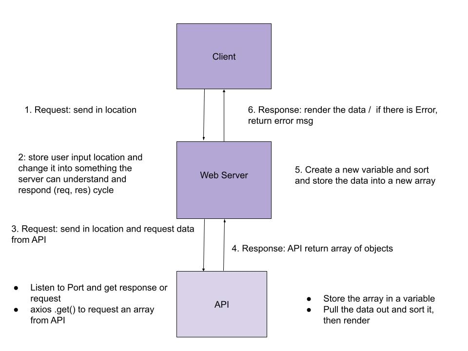
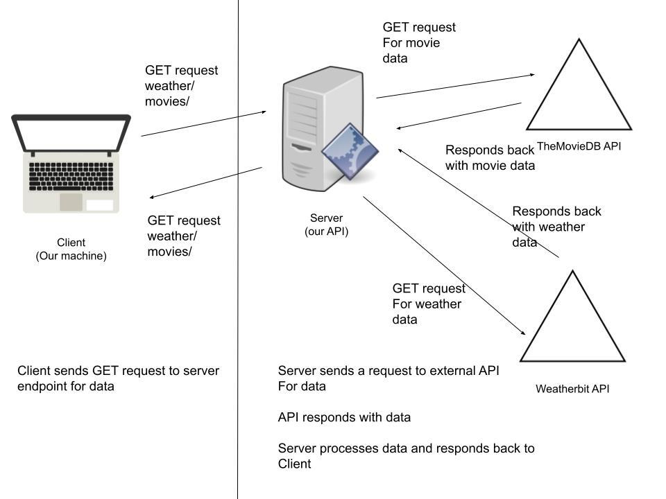

# City Explorer

**Author**: Thomas 

**Version**: 1.0.0 (increment the patch/fix version number if you make more commits past your first submission)

Website: https://cityxplorer.netlify.app/
server:  https://city-explorer-api-qoh3.onrender.com/ 
## Overview
<!-- Provide a high level overview of what this application is and why you are building it, beyond the fact that it's an assignment for this class. (i.e. What's your problem domain?) -->

## Getting Started
<!-- What are the steps that a user must take in order to build this app on their own machine and get it running? -->

## Architecture
<!-- Provide a detailed description of the application design. What technologies (languages, libraries, etc) you're using, and any other relevant design information. -->

## Change Log
<!-- Use this area to document the iterative changes made to your application as each feature is successfully implemented. Use time stamps. Here's an example:

01-01-2001 4:59pm - Application now has a fully-functional express server, with a GET route for the location resource. -->

03-07-2023 1530 - Weibiste is up with API token
03-07-2023 2030 - weather function 
03-07-2023 2330 - error function 

Name of feature: 1. Set up

Estimate of time needed to complete: 660min_

Start time: 1430

Finish time: 1530

Actual time needed to complete: 60min

---------

Name of feature: _2. weather

Estimate of time needed to complete: 180min

Start time: 1530_

Finish time: 2030_

Actual time needed to complete: _5hr

----------

Name of feature: 3. error

Estimate of time needed to complete: 180min

Start time: 2030

Finish time: 2330

Actual time needed to complete: 180min

03-08-2023 2100 - Weather is Live
03-08-2023 2300 - Movie is Live
03-09-2023 0000 - Page is Live

Name of feature: 1. Weather  Live

Estimate of time needed to complete: 660min_

Start time: 1430

Finish time: 2100

Actual time needed to complete: 7hr

---------

Name of feature: 2. movie

Estimate of time needed to complete: 5hrs

Start time: 2100

Finish time: 2300

Actual time needed to complete: 2hr

---------

Name of feature: 3 live

Estimate of time needed to complete: 1hrs

Start time: 2300

Finish time: 0000

Actual time needed to complete: 1hr

--------------------------------------------------

Lab9
03-09-2023 1500 - Refactor

Name of feature: 1. Refactor

Estimate of time needed to complete: 60min_

Start time: 1430

Finish time: 1500

Actual time needed to complete: 30min

---------

03-10-2023 1600 - Refactor

Name of feature: 1. Performance

Estimate of time needed to complete: 240min_

Start time: 1430

Finish time: 1600

Actual time needed to complete: 1.5hr

## Credit and Collaborations
<!-- Give credit (and a link) to other people or resources that helped you build this application. -->
